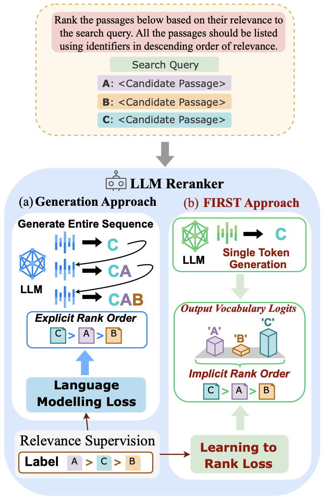

# FIRST: Faster Improved Listwise Reranking with Single Token Decoding

This repository contains the code for the paper [FIRST: Faster Improved Listwise Reranking with Single Token Decoding](https://arxiv.org/pdf/2406.15657)

FIRST is a novel listwise LLM reranking approach leveraging the output logits of the first generated identifier to obtain a ranked ordering of the input candidates directly. FIRST incorporates a learning-to-rank loss during training, prioritizing ranking accuracy for the more relevant passages.




## Installation
You need to install the tevatron library (original source [here](https://github.com/texttron/tevatron)) which provides the framework for retrieval.

```
git clone https://github.com/gangiswag/llm-reranker.git
cd llm-reranker
conda create --name reranker python=3.9.18
cd tevatron
pip install --editable .
pip install beir
```
**Note:** You need to install the vLLM library (instructions [here](https://docs.vllm.ai/en/latest/getting_started/installation.html)) which provides optimization for LLM inference.

Before running the scripts below, do
```
export REPO_DIR=<path to the llm-reranker directory 
```

## 1. Retrieval
We use [contriever](https://github.com/facebookresearch/contriever) as the underlying retrieval model. The precomputed query and passage embeddings for BEIR are available [here](https://huggingface.co/datasets/rryisthebest/Contreiever_BEIR_Embeddings).

**Note:** If you wish to not run the retrieval yourself, the retrieval results are provided [here](https://drive.google.com/drive/folders/1eMiqwiTVwJy_Zcss7LQF9hQ1aeTFMZUm?usp=sharing) and you can directly jump to [Reranking](#2-reranking)


To run the contriever retrieval using the precomputed encodings

```
bash bash/beir/run_1st_retrieval.sh <Path to folder with BEIR encodings>
```
To get the retrieval scores, run:

```
bash bash/beir/run_eval.sh rank
```

## 2. Reranking
### 2a. Baseline Cross-encoder reranking

To run the baseline cross encoder re-ranking, run:
```
bash bash/beir/run_rerank.sh
```
### 2b. FIRST LLM Reranking

To convert the retrieval results to input for LLM reranking, run:

```
bash bash/beir/run_convert_results.sh
```

We provide the trained FIRST reranker [here](https://huggingface.co/rryisthebest/First_Model).

To run the FIRST reranking, run:

```
bash bash/beir/run_rerank_llm.sh
```

To evaluate the reranking performance, run:

```
bash bash/run_eval.sh rerank

```
**Note:** Set flag --suffix to "llm_FIRST_alpha" for FIRST reranker evaluation or "ce" for cross encoder reranker

## 3. Model Training
We also provide the data and scripts to train the LLM reranker by yourself if you wish to do so.
### 3a. Training Dataset
Converted training dataset (alphabetic IDs) is on [HF](https://huggingface.co/datasets/rryisthebest/rank_zephyr_training_data_alpha). The standard numeric training dataset can be found [here](https://huggingface.co/datasets/castorini/rank_zephyr_training_data).

### 3b. Training
We support three training objectives:

- **Ranking**: The Ranking objective uses a learning-to-rank algorithm to output the logits for the highest-ranked passage ID.
- **Generation**: The Generation objective follows the principles of Causal Language Modeling, focusing on permutation generation.
- **Combined**: The Combined objective, which we introduce in our paper, is a novel weighted approach that seamlessly integrates both ranking and generation principles, and is the setting applied to the FIRST model.


To train the model, run:
```
bash bash/beir/run_train.sh
```

To train a gated model, login to Huggingface and get token access at huggingface.co/settings/tokens.
```
huggingface-cli login
```
## 4. Relevance Feedback
We also provide scripts here to use the LLM reranker for a downstream task, such as relevance feedback. [Inference-time relevance feedback](https://arxiv.org/pdf/2305.11744) uses the reranker's output to distill the retriever's query embedding to improve recall. 
### 4a. Dataset preparation for relevance feedback
To prepare dataset(s) for relevance feedback, run:
```
bash bash/beir/run_prepare_distill.sh <Path to folder with BEIR encodings>
```
### 4b. Distillation (Relevance Feedback Step)
You can choose to run distillation with either the cross encoder or the LLM reranker or both sequentially.
To perform the relevance feedback distillation step, run:
```
bash bash/beir/run_distill.sh
```
This step creates new query embeddings after distillation.

### 4c. 2nd Retrieval
To perform the retrieval step with the new query embedding after distillation, run:
```
bash bash/beir/run_2nd_retrieval.sh  <Path to folder with BEIR encodings>
```

### 4d. Relevance feedback evaluation
To evaluate the 2nd retrieval step, run:
```
bash bash/beir/run_eval.sh rank_refit
```

## Citation

If you found this repo useful for your work, please consider citing our papers:

```
@article{reddy2024first,
  title={FIRST: Faster Improved Listwise Reranking with Single Token Decoding},
  author={Reddy, Revanth Gangi and Doo, JaeHyeok and Xu, Yifei and Sultan, Md Arafat and Swain, Deevya and Sil, Avirup and Ji, Heng},
  journal={arXiv preprint arXiv:2406.15657},
  year={2024}
}
```

```
@article{reddy2023inference,
  title={Inference-time Re-ranker Relevance Feedback for Neural Information Retrieval},
  author={Reddy, Revanth Gangi and Dasigi, Pradeep and Sultan, Md Arafat and Cohan, Arman and Sil, Avirup and Ji, Heng and Hajishirzi, Hannaneh},
  journal={arXiv preprint arXiv:2305.11744},
  year={2023}
}
```

We also acknowledge the following opens-source repos, which were instrumental for this work:
- [Tevatron](https://github.com/texttron/tevatron) for retrieval framework
- [RankLLM](https://github.com/castorini/rank_llm/) for LLM reranking inference backbone.


